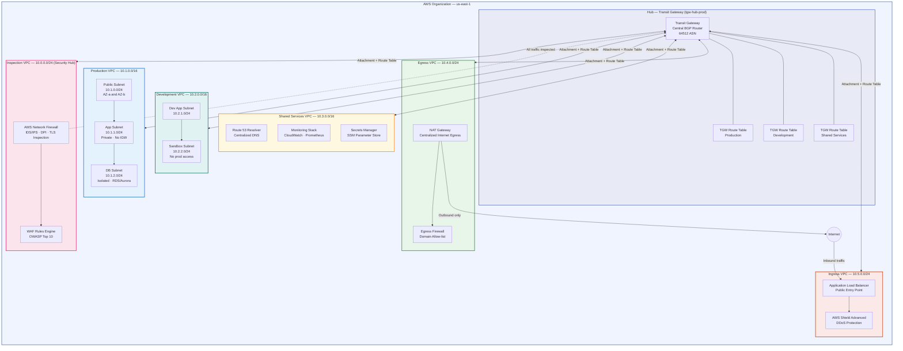

# Task 1.1 — AWS Hub-and-Spoke Network Architecture Diagram

## Mermaid.js Code

Paste the code block below into [mermaid.live](https://mermaid.live) to render the diagram.

---

## Design Decisions

| Decision | Rationale |
|----------|-----------|
| Centralized Inspection VPC | Single enforcement point for all traffic — simpler to audit |
| Separate Egress and Ingress VPCs | Isolates inbound and outbound paths; failure in one does not affect the other |
| TGW Route Tables per environment | Prevents Dev from routing to Production at the routing layer, not just SG layer |
| No IGW on Production VPC | Eliminates accidental public exposure of production workloads |
| Shared Services VPC | Central DNS, monitoring, and secrets avoid per-VPC duplication |
